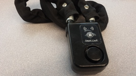
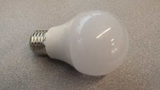
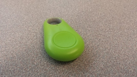
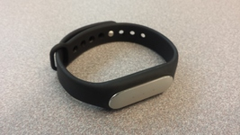
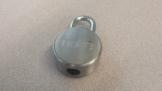

# IoT Lab
## Demonstrations

ID | Preview                            | Device                                                    | Type            | Technology    | Description       
---|------------------------------------|-----------------------------------------------------------|-----------------|---------------|-----------
01 |    | [SmartLock Y797](01_SmartLockY797_BLE_Lock/)              | Lock            | Bluetooth LE  | Smart lock
02 |        | [Magic Blue](02_MagicBlue_BLE_Bulb/)                      | Bulb            | Bluetooth LE  | RGBW smart bulb
03 |             | [iTag](03_iTag_BLE_Tag/)                                  | Tag             | Bluetooth LE  | Smart tag
04 |     | [Xiaomi Mi Band 1S](04_XiaomiMiBand_BLE_Fitness_Tracker/) | Fitness tracker | Bluetooth LE  | Smart fitness tracker
05 |             | [Noke](05_Noke_BLE_Lock/)                                 | Lock            | Bluetooth LE  | Smart Lock

## Requirements
### Tools
- [pygatt](https://github.com/peplin/pygatt)
- [GATTacker](https://github.com/securing/gattacker)
- [pyshark](https://pypi.python.org/pypi/pyshark)
- tshark (`sudo apt-get install tshark`)

### Mobile Appllications
- [SLBLOCK](https://play.google.com/store/apps/details?id=hr.android.ble.smartlocck_solebe)
- [LED Magic Blue](https://play.google.com/store/apps/details?id=com.Zengge.BluetoothLigthDark)
- [iSearching](https://play.google.com/store/apps/details?id=com.lenzetech.antilost)
- [Noke](https://play.google.com/store/apps/details?id=com.fuzdesigns.noke&hl=en)
